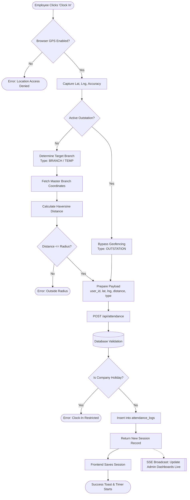
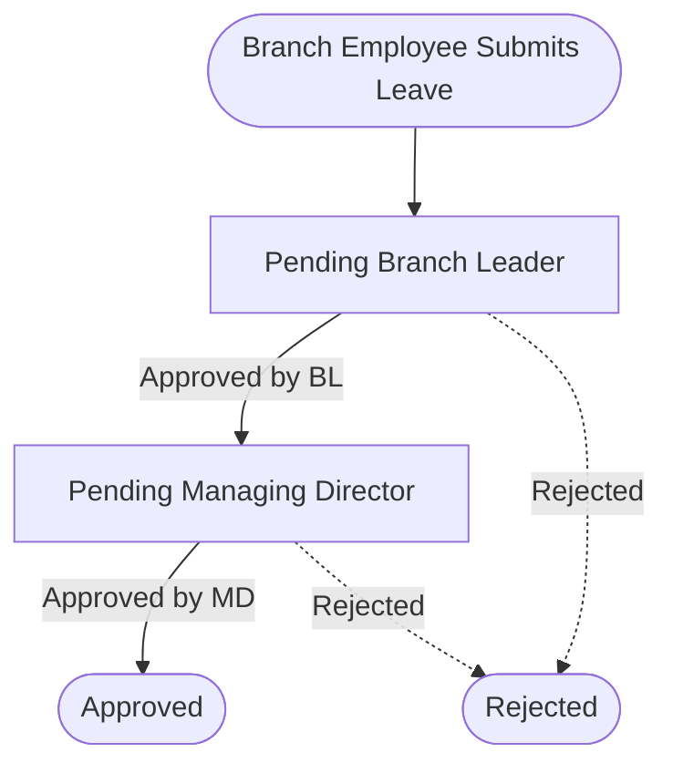
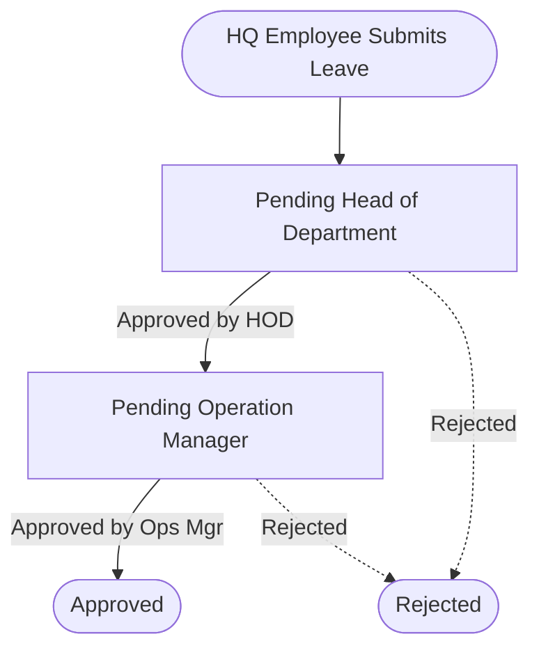
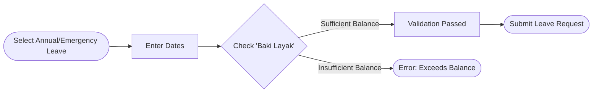
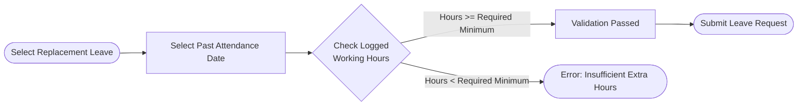
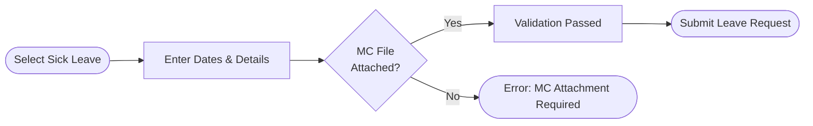
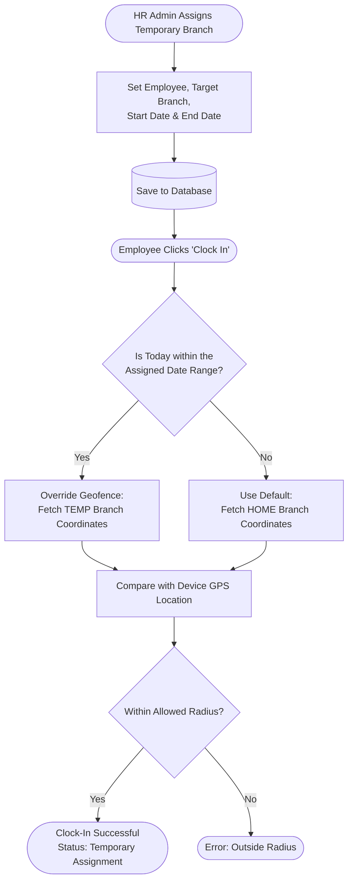

# Rayhar Group Employee Portal - Core Modules Functionality & Role Access Report

This document provides a detailed explanation of the core modules within the Rayhar Group Employee Portal: **Attendance**, **Leave**, and **Outstation / Multi-Location Management**. It outlines the functionalities available, how staff use them to perform daily tasks, and what each role can access.

---

## 1. Role-Based Access Control

The system employs a strict role-based access structure to ensure data privacy and appropriate managerial oversight. The roles are defined as:
- `employee`
- `branch_officer`
- `branch_leader`
- `head_of_department`
- `hr_admin`
- `managing_director`
- `operation_manager`
- `finance_manager`

---

## 2. Attendance Management Module

### A. My Attendance Page (`/attendance`)
*Access: All Roles*

This is the primary interface for all staff members to interact with their daily attendance.

#### Clock-In System Flow
The following diagram illustrates exactly what happens behind the scenes when an employee clicks "Clock In", from GPS validation to database insertion and live dashboard updates.



#### Technical Implementation: GPS & Geolocation
The system relies on the device's native hardware to ensure high-accuracy location tracking during clock-ins.
1. **HTML5 Geolocation API:** When a user clicks "Clock In", the frontend triggers `navigator.geolocation.getCurrentPosition()`. This prompts the browser to request location permissions from the user.
2. **Coordinate Capture:** Once allowed, the system captures three precise metrics from the device's GPS hardware (or Wi-Fi/Cellular triangulation):
   - `Latitude`
   - `Longitude`
   - `Accuracy` (The confidence radius in meters)
3. **The Haversine Formula:** To enforce geofencing, the system fetches the assigned branch's master coordinates from the database. It then applies the **Haversine formula**—a mathematical equation used in navigation to calculate the shortest distance over the Earth's surface—to determine the exact distance (in meters) between the device and the branch.
4. **Validation:** If the calculated distance exceeds the configured branch radius (e.g., 50 meters), the clock-in is rejected unless the employee has an active Outstation bypass.

**Key Functionalities for Staff:**
1. **Clock In & Clock Out:**
   - Staff use this page to record their attendance.
   - **Geolocation & Geofencing:** The system requires GPS access. Upon clicking "Clock In", it verifies the staff's coordinates against their assigned branch's coordinates. The clock-in is only successful if they are within the acceptable radius (e.g., 50 meters).
   - **Location Updates:** Staff can update their location midway through the day using the "Update Location" feature.

2. **Real-time Monitoring & KPIs:**
   - **Working Hours Timer:** Displays a live timer of the hours worked since clocking in.
   - **Monthly Stats:** Displays Key Performance Indicators (KPIs) such as Total Hours (Today, Week, Month), Productive Hours, Break Time (calculated automatically), and counts for Company Leave and Approved Leaves taken.

3. **History Logs (Table View):**
   - Displays a tabular log of past attendance records including: `Date`, `Time In`, `Time Out`, `Status` (Present, Late, Absent, Approved Leave, Weekend), `Late duration`, and total `Working Hours`.
   - Connected to a real-time stream (Server-Sent Events), so statuses update live without requiring a page refresh.

4. **Filtering & Exporting Records:**
   - **Filters:** Staff can toggle between "Day Mode" (viewing a specific date) or "Month Mode" (viewing the entire month using a Month Picker). They can also filter by status (e.g., "Late", "Absent").
   - **Export (PDF & CSV):** Staff can export their attendance records. The export strictly follows the currently selected filter.

### B. Team Attendance (`/team-attendance`)
*Access: Branch Leaders & Heads of Department (HOD)*

**Key Functionalities for Managers:**
- **Team Monitoring:** Branch Leaders can view the attendance status exclusively for staff within their assigned branch. HODs can view staff within their department.
- **Search & Filters:** Managers can search for specific employees by name, and filter the view by date (Day/Month view) and by status.

### C. Workforce Analytics & Attendance Dashboard (`/hr-analytics/attendance`)
*Access: HR Admin, Managing Director, Operation Manager, Finance Manager*

**Key Functionalities for HR/Management:**
1. **Live Presence Tracking:** Uses real-time data streams to display exactly how many employees are currently Present, Late, Absent, or On Leave across the entire company today.
2. **Absence & Latecomer Identification:** Generates automatic lists of absent employees or latecomers, allowing HR to quickly follow up.
3. **Comprehensive Data View:** Views daily attendance for every single employee in the organization.

---

## 3. Leave Management Module

### Module Overview Preview
The Leave Management system is divided into several sub-modules catering to different roles, from basic employee applications to high-level HR administration:

| Sub-Module / Page | Primary User(s) | Functionality Preview | Purpose |
| :--- | :--- | :--- | :--- |
| **Leave Application & Forms**<br>(`/leave/apply`, `/leave/forms`) | All Staff | - Apply for leave & attach MCs.<br>- Track approval status of personal applications. | To allow employees to seamlessly request time off and view their personal balances. |
| **Team Leave Requests**<br>(`/leave/team`) | Branch Leaders, HODs | - Review team leave applications.<br>- Warns of overlapping leaves. | To give direct supervisors control over their specific team's scheduling. |
| **Leave Approval Hub**<br>(`/leave/admin`) | HR Admin, Management | - Centralized list of company-wide requests.<br>- Multi-tier approval/rejection buttons. | To provide top-level management and HR a single dashboard to finalize leave applications. |
| **Company Leave Calendar**<br>(`/leave/calendar`) | HR Admin, Managers | - Monthly visual grid of approved/pending leaves.<br>- Color-coded by leave type. | To ensure sufficient manpower is available across departments by visually spotting absent personnel. |
| **Leave Entitlement Management**<br>(`/leave/entitlement`) | HR Admin | - Set yearly leave quotas.<br>- Track balances and carry-forwards.<br>- Has 8 inner modules for precise adjustments. | To strictly govern how many paid days off each employee is legally entitled to per year. |

### Leave Approval Workflow
The system utilizes a multi-tier approval workflow that differs slightly depending on whether the employee is stationed at a Branch or HQ.

#### 1. Branch Staff Approval Flow


#### 2. HQ Staff Approval Flow


### A. Leave Application & Form Validation Flows (`/leave/apply`, `/leave/forms`)
*Access: All Roles*

When applying for leave, the system performs strict validations depending on the specific leave type chosen before the form can be successfully submitted.

#### 1. Annual & Emergency Leave Validation
Must check against the user's available "Baki Layak" (Leave Balance).


#### 2. Replacement Leave (Cuti Ganti) Validation
Must verify that the user actually worked the required extra hours on a past date.


#### 3. Sick Leave (Cuti Sakit) Validation
Must include a Medical Certificate (MC) attachment.


**Key Functionalities for Staff:**
1. **Applying for Leave:** The forms dynamically adapt and block submission unless the rules above are met.
2. **Tracking Balances & Status:** The form automatically checks and displays the user's remaining leave entitlement. On the "My Leave Requests" page, staff can track if their application is **Pending**, **Approved**, or **Rejected**.

### B. Team Leave Requests (`/leave/team`)
*Access: Branch Leaders & HODs*

**Key Functionalities for Supervisors:**
1. **Review & Approval:** Supervisors can review leave applications strictly for their own subordinates.
2. **Clash Warnings:** The system highlights if other team members are already on leave during the requested dates, helping managers avoid manpower shortages before approving.
3. **Remarks:** Supervisors can leave notes/reasons when rejecting or approving a leave.

### C. Leave Administration & Entitlement (`/leave/admin`, `/leave/entitlement`)
*Access: HR Admin & Management*

**Key Functionalities for HR:**
1. **Company-Wide Approval Hub (`/leave/admin`):** HR can review and act on leave applications from any employee in the company.
2. **Leave Calendar (`/leave/calendar`):** A global calendar plotting every approved leave across the company for quick visual reference.
3. **Leave Entitlement Management (`/leave/entitlement`):** The master control center for HR to govern the strict rules of how many paid days off each employee is legally entitled to. 

#### Leave Entitlement Management Modules (The 8 Core Modules)
Within the `/leave/entitlement` page, HR has access to 8 dedicated modules to precisely manage staff leave balances:

| Module Name | Functionality & Description | Purpose |
| :--- | :--- | :--- |
| **Annual Leave Allocation** | Set each employee's base entitlement for the leave year according to role, policy, or grade. | To establish the baseline paid leave days at the start of the year. |
| **Carry Forward Leave** | Move approved unused leave from the previous year into the current cycle based on carry-forward rules. | To ensure staff don't lose earned leave, following company carry-forward limits. |
| **Additional Leave Allocation** | Grant extra leave days for rewards, compensation, retention, or special business approvals. | To provide bonuses or compensate staff outside the standard annual allowance. |
| **Manual Leave Adjustments** | Correct balances when there is a policy update, payroll correction, or data reconciliation issue. | To fix errors or handle exceptional edge cases in leave balances. |
| **Maternity Leave** | Leave granted to female employees before and/or after childbirth. | To manage legal maternity leave entitlements and durations. |
| **Leave Activity History** | Track every allocation, deduction, and correction so HR can audit the full entitlement lifecycle. | To provide a secure audit trail of who changed what balance and when. |
| **Replacement Leave Validation** | Validate employee's replacement leave hours (Cuti Ganti) after they have worked on the replacement date. | To ensure replacement leaves are genuinely earned before the balance is credited. |
| **Workforce Leave Balance** | Centralized view of every staff member's current leave entitlement and remaining balance. | To give HR a quick, holistic dashboard of everyone's remaining days off. |

---

## 4. Outstation, Temporary Branch & Multi-Location Management

This module handles employees who do not work at their standard, fixed branch on a given day. The system intelligently adapts geofencing rules based on these assignments.

### A. Outstation Management (`/outstation/my`, `/outstation/assignment`)
An Outstation assignment is when an employee travels for official company business (e.g., visiting a client, running errands, or traveling inter-state). 

#### Outstation Assignment & Clock-In Flow
```mermaid
flowchart TD
    A([HR Assigns Outstation Duty]) --> B[Set Employee, Destination,\nStart Date & End Date]
    B --> C[(Save to Database)]
    
    C --> D([Employee Clicks 'Clock In'])
    D --> E{Is Today within\nOutstation Dates?}
    
    E -- No --> F[Run Standard Branch Geofencing]
    E -- Yes --> G[Bypass Branch Geofence Validation]
    
    G --> H[Capture Exact Device GPS\n(Lat/Lng)]
    H --> I[Submit to Database]
    
    I --> J([Clock-In Successful\nStatus: OUTSTATION])
    
    J --> K([Employee Arrives at Client/Site])
    K --> L([Clicks 'Update Location'])
    L --> M[Logs New GPS Coordinate for Audit]
```

**Key Functionalities:**
1. **Request & Assignment:** Employees can apply for outstation duties, or HR can unilaterally assign them via the **Outstation Assignment** page.
2. **Geofence Override:** When an employee is on an active outstation assignment, the standard branch geofencing is overridden. When they click "Clock In", the system logs their exact GPS coordinates as "Outstation" without throwing an "Outside Radius" error.
3. **Live Arrival Checking & Location Updates:** 
   - Employees can click "Update Location" while outstationed. 
   - The system calculates the distance to the outstation destination (if a destination coordinate is set) and notifies them if they have successfully "Arrived".
4. **Outstation Reports (`/outstation/reports`):** HR can generate spreadsheets tracking outstation expenses, durations, and locations visited.

### B. Temporary Branch Assignments (`/branches/temporary-assignments`)
A Temporary Assignment is when an employee is temporarily transferred to a different Rayhar branch (e.g., An HQ staff member is sent to cover the Kemaman branch for a week).

#### Temporary Branch Assignment Flow


**Key Functionalities:**
1. **Dynamic Target Switching:** HR uses this page to define a `start_date` and `end_date` for the transfer. 
2. **Adaptive Geofencing:** During those specific dates, the employee's attendance app automatically expects them to clock in at the *Kemaman branch coordinates* instead of the *HQ coordinates*. If they try to clock in at HQ during that week, it will fail.
3. **Clear Distinctions:** These assignments appear in the attendance logs with a distinct "Temporary Assignment" status, rather than a generic "Present" status, allowing HR to track resource sharing between branches.

### C. Multi-Location Authorization
Certain roles (e.g., Upper Management, Mobile Technicians, Branch Auditors) need to move freely between multiple branches in a single day.

#### Multi-Location Clock-In Flow
```mermaid
flowchart TD
    A([HR Configures Multi-Location Access]) --> B[Employee Opens Attendance Page]
    B --> C{Is Employee Authorized\nfor Multi-Location?}
    
    C -- No --> D[Use Default Home Branch\nCoordinates]
    C -- Yes --> E[Display 'Target Branch' Dropdown]
    
    E --> F[Employee Selects Current Branch\n(e.g., HQ, Kemaman, Dungun)]
    F --> G([Employee Clicks 'Clock In'])
    D --> G
    
    G --> H[Fetch Coordinates for TARGET Branch]
    H --> I[Compare with Device GPS Location]
    
    I --> J{Within Allowed Radius?}
    J -- Yes --> K([Clock-In Successful])
    J -- No --> L([Error: Outside Radius])
```

**Key Functionalities:**
1. **Multi-Branch Selection:** Through the backend configuration, an employee's "Attendance Mode" can be set to **Multi-Location**, and an array of `Allowed Locations` is granted (e.g., `["HQ", "Kemaman", "Dungun"]`).
2. **Location Picker Dropdown:** When the employee opens their Attendance page, a dropdown appears allowing them to select their current *Target Branch* before clocking in. 
3. **Radius Validation:** The system will then dynamically validate their GPS coordinates against whichever branch they selected from their allowed list, giving them maximum operational flexibility without disabling geofencing entirely.

## 5. Report Pages (/reports)
*Access: HR Admin, Managing Director, Operation Manager, Finance Manager*

The Report Pages serve as the central data extraction hub for the company's management and HR department. These modules are specifically designed for auditing, end-of-month payroll reconciliation, and overall workforce analytics.

### Module Overview

| Report Module | Key Features & Filters | Primary Purpose |
| :--- | :--- | :--- |
| **Attendance Reports**<br>(/reports/attendance) | - Filter by Day or Month view.<br>- Cross-filter by Branch, Department, and Status (Late, Absent, Present).<br>- Displays detailed metrics including Clock-In/Out times, exact Geofence Distance, and precise GPS Coordinates. | To extract raw timesheet data for payroll processing and audit employee punctuality or suspected GPS spoofing. |
| **Leave Reports**<br>(/reports/leave) | - Filter by Leave Type (Sick, Annual, etc.) and Approval Status.<br>- Highlights total days taken within the selected date range. | To generate comprehensive logs of staff absences and verify leave deductions for the month. |
| **Department Reports**<br>(/reports/department) | - Aggregates data on a macro level rather than individual employee level.<br>- Compares metrics between different company departments. | To give higher management a bird's-eye view of which departments are most productive or have the highest absenteeism. |
| **Outstation Reports**<br>(/outstation/reports) | - Tracks employees working off-site.<br>- Filters by destination and duration. | To audit travel logs and verify outstation activities for expense claims. |

### Standardized Reporting Features
Across all the report modules, the system implements standardized tools to ensure HR can easily manipulate the data:
1. **KPI Summary Cards:** The top of every report page displays dynamic KPI widgets (e.g., "Total Late Arrivals", "Total Approved Leaves") that instantly update based on the applied filters.
2. **Export Engine:** Every report features an **Export** button allowing administrators to download the currently filtered dataset as:
   - **CSV / Excel:** For manual data manipulation and payroll system importing.
   - **PDF:** For generating read-only, formal printable reports.
3. **Dynamic Table Pagination:** The data tables automatically paginate and index the records to handle large company-wide datasets without slowing down the browser.

## 6. Employee Management Module (/employees)
*Access: HR Admin & Management*

The Employee Management module serves as the primary administrative hub for onboarding, monitoring, and configuring staff accounts.

### A. Employee Directory
The main list view allows HR to browse and manage all employee profiles across the entire organization.

**Key Features:**
- **Search & Filtering:** Rapidly find specific employees using the search bar or multi-select dropdown filters (Filter by Branch, Department, Position, and Active/Inactive Status).
- **Staff Onboarding:** The **+ ADD STAFF** button allows HR to quickly provision new accounts into the system.
- **Quick Status Toggles:** HR can instantly toggle an employee's status between **Active** and **Inactive** (e.g., if an employee resigns) or permanently delete a profile directly from the table.

### B. Staff Profile & Analytics Modal
Clicking on an individual staff member opens a comprehensive, deep-dive modal containing 5 specialized tabs to fully manage that employee's lifecycle:

#### Tab 1: Staff Profile & Analytics (Overview)
This default tab provides a 360-degree view of the employee's standing in the company:
1. **Basic Information:** Displays their Avatar, User ID, assigned Branch, Department, Role (e.g., Operation Manager), and the date their account was created.
2. **Performance Analytics:** 
   - Tracks the exact number of days they were **Present**, **Late**, or **Absent**.
   - Calculates both a **Monthly Rate** and a **Yearly Rate**.
   - The system automatically flags concerning attendance behavior with visual tags like **"REVIEW"** (yellow) or **"WARNING"** (red) if their absentee or late rates exceed acceptable thresholds.
3. **Leave Utilization Dashboard:** 
   - Displays their exact leave limits: **Total Entitled**, **Approved Taken**, **Remaining Balance**, and an overall **Utilization Percentage**.
   - Breaks down the data further by showing counts of Pending Requests vs. Rejected Requests, and itemizes specific leave types used (e.g., Replacement Leave, Unpaid Leave, Medical Leave).
4. **Today's Attendance:** A quick-glance widget showing what time they clocked in/out on the current day.

#### Tab 2: Attendance Settings
Allows HR to configure customized rules for this specific employee, such as altering their standard expected clock-in time (e.g., shifting their schedule to 10:00 AM instead of 9:00 AM).

#### Tab 3: Temporary Assignment
Provides a direct shortcut to assign this specific employee to a temporary branch, seamlessly overriding their geofencing rules for a set date range.

#### Tab 4: Multi Location Branch
For mobile employees (like auditors or regional managers), HR uses this tab to select exactly which branches this user is authorized to clock in from. It populates their "Target Branch" dropdown on the attendance page.

#### Tab 5: Location History
A dedicated audit log showing a historical record of exactly where this employee has clocked in from, plotting their past GPS coordinates and distances from the branch.
