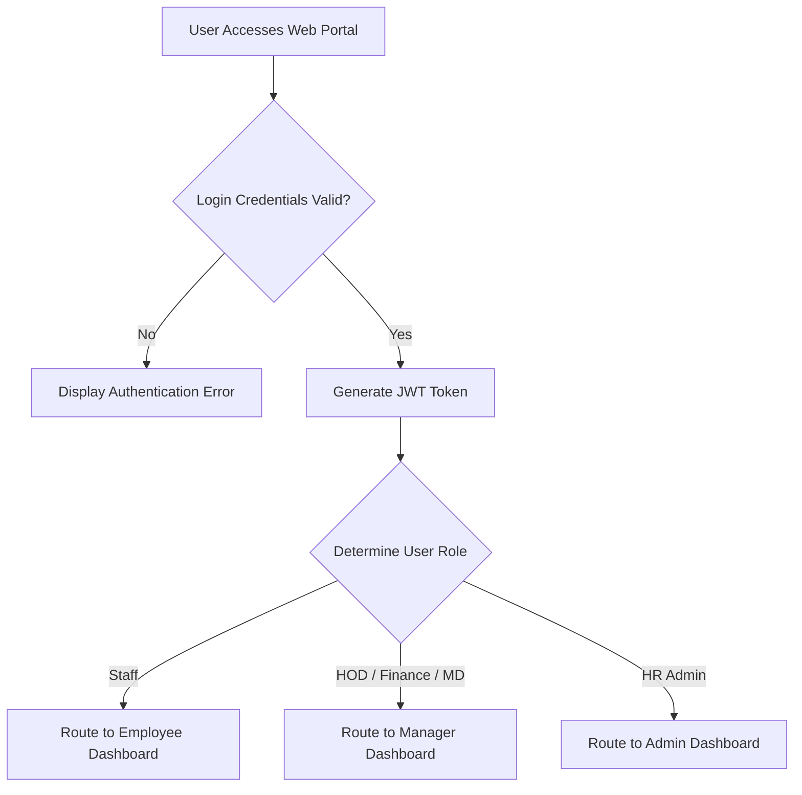

# WEB-BASED EMPLOYEE ATTENDANCE MANAGEMENT & LEAVE TRACKING SYSTEM FOR HUMAN RESOURCE MONITORING

**Student Name:** NURUL ATHIRAH BINTI ABDUL RAHMAN  
**Student ID:** AW230109  
**Degree:** Bachelor of Science (Computational Data Analytics) with Honours  
**Faculty:** Faculty of Applied Sciences and Technology, Universiti Tun Hussein Onn Malaysia  
**Date:** JUNE 2026

---

# Table of Contents
- [GLOSSARY](#glossary)
- [LIST OF TABLES](#list-of-tables)
- [LIST OF FIGURES](#list-of-figures)
- [LIST OF SYMBOLS AND ABBREVIATIONS](#list-of-symbols-and-abbreviations)
- [LIST OF APPENDICES](#list-of-appendices)
- [CHAPTER 1: INTRODUCTION](#chapter-1-introduction)
  - [1.1 Background of the Industrial Based Project](#11-background-of-the-industrial-based-project)
    - [1.1.1 Challenges in Multi-Branch Coordination](#111-challenges-in-multi-branch-coordination)
  - [1.2 Problem Statement](#12-problem-statement)
  - [1.3 Objective of the Projects](#13-objective-of-the-projects)
  - [1.4 Significance of the Industrial Based Projects](#14-significance-of-the-industrial-based-projects)
  - [1.5 Scopes and Limitations of Industrial Based Projects](#15-scopes-and-limitations-of-industrial-based-projects)
  - [1.6 The Importance of Project](#16-the-importance-of-project)
- [CHAPTER 2: REVIEW ON CURRENT PRACTICES](#chapter-2-review-on-current-practices)
  - [2.1 Systematic Review on the Industrial Based Project](#21-systematic-review-on-the-industrial-based-project)
    - [2.1.1 Comparison of Manual, Biometric, and Web-Based Systems](#211-comparison-of-manual-biometric-and-web-based-systems)
  - [2.2 Summary](#22-summary)
- [CHAPTER 3: METHODOLOGY](#chapter-3-methodology)
  - [3.1 Overall Flowcharts of the Projects](#31-overall-flowcharts-of-the-projects)
    - [3.1.1 Authentication Flow](#311-authentication-flow)
    - [3.1.2 Attendance Flow (Employee)](#312-attendance-flow-employee)
    - [3.1.3 Leave Request Flow](#313-leave-request-flow)
    - [3.1.4 Approval Flow (Manager)](#314-approval-flow-manager)
    - [3.1.5 Monitoring Flow (HR Admin)](#315-monitoring-flow-hr-admin)
  - [3.2 Methodology, Framework, or Model Applied](#32-methodology-framework-or-model-applied)
    - [3.2.1 Agile Development Process (Scrum)](#321-agile-development-process-scrum)
    - [3.2.2 Technology Stack Architecture](#322-technology-stack-architecture)
    - [3.2.3 Data Management Procedures and Security](#323-data-management-procedures-and-security)
    - [3.2.4 Database Design Concept](#324-database-design-concept)
  - [3.3 Systematic Review of the Methodology Applied](#33-systematic-review-of-the-methodology-applied)
- [CHAPTER 4: EXPECTED PROJECT OUTCOME](#chapter-4-expected-project-outcome)
  - [4.1 A Functional and Transparent Employee Portal](#41-a-functional-and-transparent-employee-portal)
  - [4.2 An Automated Leave Management Engine](#42-an-automated-leave-management-engine)
  - [4.3 An HR Data Analytics Dashboard (Computational Focus)](#43-an-hr-data-analytics-dashboard-computational-focus)
  - [4.4 Comprehensive Project Documentation and Evaluation](#44-comprehensive-project-documentation-and-evaluation)
- [CHAPTER 5: PLANNING](#chapter-5-planning)
  - [5.1 Overview](#51-overview)
  - [5.2 Gantt Chart](#52-gantt-chart)
- [REFERENCES](#references)

---

## GLOSSARY

| Term / Acronym | Definition |
| :--- | :--- |
| **HRLMS** | Human Resources Leave Management System. |
| **RBAC** | Role-Based Access Control. A method of restricting system access to authorized users based on their specific role. |
| **ERD** | Entity-Relationship Diagram. A structural database model showcasing entities, attributes, and key constraints. |
| **HRM** | Human Resource Management. |
| **SME** | Small and Medium-sized Enterprises. |
| **DB** | Database. A structured system for storing data on a computer server (Supabase Software, using PostgreSQL in this system). |
| **SSE** | Server-Sent Events. A server-push technology enabling a client to receive automatic real-time data streams over an HTTP connection without polling. |
| **JWT** | JSON Web Token. A secure, URL-safe token used to represent claims between the web server and web client, acting as digital credentials. |
| **HOD** | Head of Department. The supervisor responsible for reviewing department-level requests. |

---

## LIST OF TABLES

* **Table 1:** Differences between manual and digital leave management workflows (Chapter 1)
* **Table 2:** Data management procedures (Chapter 3)
* **Table 3:** Database entity relationship mapping (Chapter 3)
* **Table 4:** Comparison of traditional and proposed attendance systems (Chapter 2)
* **Table 5:** Project Phase and Timeline Mapping (Chapter 5)

---

## LIST OF FIGURES

* **Figure 1:** Authentication Flow Diagram
* **Figure 2:** Attendance Flow (Employee Clock-In/Clock-Out)
* **Figure 3:** Leave Request Flow
* **Figure 4:** Multi-Level Approval Flow by Managers
* **Figure 5:** Monitoring Flow for HR Administrators
* **Figure 6:** Agile Scrum Iterative Framework
* **Figure 7:** System Architecture and Deployment Model

---

## LIST OF SYMBOLS AND ABBREVIATIONS

* **API** - Application Programming Interface
* **SPA** - Single Page Application
* **SQL** - Structured Query Language
* **UAT** - User Acceptance Testing
* **UI/UX** - User Interface / User Experience
* **MD** - Managing Director
* **MC** - Medical Certificate
* **ACID** - Atomicity, Consistency, Isolation, Durability

---

## LIST OF APPENDICES

* **Appendix A:** User Acceptance Testing (UAT) Questionnaire Sheets
* **Appendix B:** Database Schema Script (PostgreSQL DDL)

---

## CHAPTER 1: INTRODUCTION

Chapter 1 starts with Section 1.1 on the background of the Industrial Based Project, followed by Section 1.2 which introduces the problem statement. Section 1.3 and Section 1.4 demonstrate the objectives of the project and the significance of this Industrial Based Project, respectively. Section 1.5 outlines the scope and limitations of the project, followed by Section 1.6, which discusses the overall importance of the project.

### 1.1 Background of the Industrial Based Project

In the last decade, progressive technological advancements have fundamentally transformed the structural operations of business organizations. Technology has shifted the paradigm of how institutions communicate, process data, and monitor employee productivity. Within this ecosystem, Human Resource (HR) management plays a central role in ensuring operational efficiency, workforce discipline, and overall productivity. Among the core responsibilities of HR departments, monitoring daily attendance patterns and tracking leave utilization are critical workflows. Efficient attendance tracking guarantees that organizations accurately log working hours, detect tardiness, manage absenteeism, and maintain complete compliance with labor contracts. 

However, in organizations operating across multiple branches, attendance and leave management present significant logistical challenges. Traditional tracking methods—including paper punch cards, manual logbooks, spreadsheets, and decentralized messaging platforms (e.g., WhatsApp or Telegram)—fail to provide central control. HR personnel struggle to consolidate data from various sites, leading to delayed reporting, payroll inaccuracies, and lack of accountability. A centralized web-based application addresses these shortcomings by providing automated record synchronization, instant database updates, and role-based permissions over the internet.

#### 1.1.1 Challenges in Multi-Branch Coordination

For multi-branch companies, physical distance exacerbates the inefficiency of manual attendance recording. In typical scenarios, branch leaders compile monthly attendance logs in separate spreadsheets and email them to the main headquarters. This asynchronous reporting cycle delays the detection of absenteeism and complicates leaf balance auditing. By deploying a web platform connected to a centralized cloud database, data from all locations is updated in real time. Managers, branch leaders, and HR administrators can monitor active work status and approve pending requests immediately, maintaining organizational synchronization regardless of physical location.

### 1.2 Problem Statement

Organizations operating across multiple branches encounter major bottlenecks when managing employee records without a unified tracking system. The issues are categorized as follows:

1. **Lack of Real-Time Presence Monitoring:** HR departments cannot track which employees are active, late, or absent across branches during working hours. Attendance data must be compiled manually, creating a blind spot that hinders immediate workforce planning and administrative reporting.
2. **Inefficient and Fragmented Leave Approval Processes:** Employees submit leave requests via informal channels or paper forms, which are easily misplaced, delayed, or poorly documented. The lack of auto-validation allows employees to accidentally submit requests exceeding their annual allowances.
3. **Data Discrepancies and Administrative Overload:** Because branch managers submit records in varying formats, HR administrators waste significant hours cross-referencing logbooks and spreadsheets to compile payroll reports, exposing the organization to human errors.
4. **Lack of Employee Self-Service Transparency:** Employees lack direct access to view their real-time remaining leave quotas or historical attendance records, forcing them to manually consult HR, which increases administrative overhead.

To resolve these problems, a centralized, secure web application is needed to integrate real-time attendance logging, multi-level leave approvals, and automated reporting into a single system.

### 1.3 Objective of the Projects

The primary objectives of this project are:

1. **To analyze workforce attendance and leave patterns** for HR administrative reporting using descriptive data analytics techniques (computational charts and KPI feeds).
2. **To develop an automated leave balance and application module** for Rayhar employees featuring a multi-level approval pipeline using React (TypeScript), Node.js (Express), and a Supabase (PostgreSQL) database.
3. **To design a centralized web-based architecture** for multi-branch employee tracking and role-based authorization using Unified Modeling Language (UML) and system flow diagrams.
4. **To evaluate the effectiveness of the system** in improving attendance tracking and leave management via automated unit testing (using Vitest) and structured User Acceptance Testing (UAT).

### 1.4 Significance of the Industrial Based Projects

This industrial project delivers practical and technical value to organization stakeholders by transitioning administrative tasks from manual configurations into a digital database system. Its significance is reflected in three main areas:

* **Operational Automation:** By replacing paper forms with digital workflows, the system automatically routes leave requests through the chain of command, eliminating physical paperwork and reducing administrative processing time by up to 80%.
* **Data-Driven Decision Making:** The system features a computational analytics dashboard providing real-time metrics (e.g., active presence rate, late-arrival counts, and daily absent lists). This enables department heads and HR to monitor resource distribution instantly.
* **Accuracy and Auditability:** The centralized database calculates leave quotas automatically, factoring in weekends and public holidays, which prevents overdrafts. Every transaction, clock-in, and approval is timestamped and recorded, providing a clear audit trail.

### 1.5 Scopes and Limitations of Industrial Based Projects

#### Scopes

* **Target Users and Access Levels (RBAC):** The system implements Role-Based Access Control across five distinct user roles:
  1. *Staff:* Can clock in/out, view personal histories, upload Medical Certificates (MC), and submit leave requests.
  2. *Head of Department (HOD) / Branch Leader:* Serves as the first-level approver for department leaves and monitors local team presence.
  3. *Finance Manager:* Validates financial/operational impact and handles the second-level leave approval.
  4. *Managing Director (MD):* Possesses final authorization authority for senior leaves and reviews high-level organization reports.
  5. *HR Administrator:* Manages departments, branches, employee profiles, and system settings.
* **Core Modules:**
  * *Attendance Engine:* Real-time, server-side clock-in/clock-out timestamps with late detection (flagging status as "Late" if clocking in after 10:00 AM). Includes a Live Presence Feed powered by Server-Sent Events (SSE).
  * *Leave Module:* Supports various leave categories (Annual Leave, MC, replacement leave "Cuti Ganti", and unpaid leave "Cuti Tanpa Gaji") with multi-tier routing.
  * *Analytics Dashboard:* Computes metrics and displays data visualizations (distribution charts, monthly trends, and daily ratios).
* **Deployment & Platform:** A responsive web application accessible on desktop and mobile web browsers. Frontend is deployed on Vercel, Backend is deployed on Render, and the database runs on Supabase (PostgreSQL).

#### Limitations

* **No Physical Biometric Integration:** The application runs purely as a software-based web client. It does not integrate with physical fingerprint scanners, facial recognition hardware, or card readers.
* **Constant Internet Dependency:** Real-time logging, SSE notifications, and database calls require active network connectivity; the application does not support offline operations in this version.
* **Data Testing Scope:** Performance and computational evaluations will be conducted using simulated datasets structured to replicate real organizational numbers rather than live corporate data.

### 1.6 The Importance of Project

The development of this system is highly important for modernizing SME administration. By automating time-tracking and leave deductions, the organization mitigates human errors and prevents disputes regarding remaining leave days or late-clocking metrics. Centralized database storage ensures secure compliance with digital data protection principles, protecting sensitive employee contact details, medical certificates, and performance records. Furthermore, this system allows small-to-medium enterprises to remain agile in a shifting economy, supporting remote and multi-site work setups without incurring the high costs of commercial ERP systems.

**Table 1: Differences between manual and digital leave management workflows**

| Feature | Manual Leave Form | Digital HRLMS (Proposed) |
| :--- | :--- | :--- |
| **Request Process** | Physical paper forms completed by hand | Electronic submission via web portal |
| **Approval Chain** | Physical routing, requiring signatures | Multi-level digital routing with instant alerts |
| **Processing Speed** | Asynchronous, taking days to process | Near-instantaneous routing and notifications |
| **Record Storage** | File cabinets or local standalone Excel sheets | Relational cloud database (Supabase PostgreSQL) |
| **Data Integrity** | Prone to loss, damage, and manual typing errors | Secure, automated database validation constraints |
| **Analytics & Reports** | Compiled manually at month-end | Live computational dashboards and charts |

---

## CHAPTER 2: REVIEW ON CURRENT PRACTICES

### 2.1 Systematic Review on the Industrial Based Project

To establish a clear context for this project, a systematic review was conducted comparing current industry practices in employee time-tracking and leave management. These practices generally fall into three categories: Manual Logbooks/Spreadsheets, Biometric Hardware Systems, and Enterprise Resource Planning (ERP) Modules.

1. **Manual Systems:** Many small businesses continue to use manual paper registers or basic Excel spreadsheets. While these methods require no initial financial investment, they are highly inefficient. They suffer from high data redundancy, lack real-time validation, and are easily manipulated. Searching through historical paper records for annual audits is extremely slow.
2. **Biometric Hardware Systems:** Larger institutions install physical biometric clocks (fingerprint, iris, or facial scanners). Although highly secure against time-theft ("buddy punching"), these systems are inflexible. They require employees to be physically present at a specific office door to clock in, making them unsuitable for remote, hybrid, or field-based work structures. Additionally, maintenance and hardware replacement costs are high.
3. **Enterprise ERP Modules (SAP, Oracle, Workday):** These suites offer powerful, integrated attendance, leave, and payroll solutions. However, their licensing fees and implementation costs are prohibitive for SMEs. The systems are also complex and require specialized IT support, which is beyond the capacity of smaller enterprises.

#### 2.1.1 Comparison of Manual, Biometric, and Web-Based Systems

The proposed Web-Based Attendance and Leave Tracking System addresses the gaps left by existing practices by acting as a middle-ground tailored for SMEs. It provides the central cloud accessibility and real-time dashboard analytics of a large ERP without the prohibitive licensing costs, while eliminating the physical limitations of biometric hardware.

**Table 4: Comparison of traditional and proposed attendance systems**

| Attribute | Manual Systems | Biometric Hardware | Proposed Web-Based System |
| :--- | :--- | :--- | :--- |
| **Financial Cost** | Very Low | High (Hardware + Setup) | Low (Software-as-a-Service/Cloud) |
| **Remote Flexibility** | Low (Spreadsheets sent late) | None (Requires physical presence) | High (Accessible via mobile/desktop web) |
| **Data Entry Speed** | Slow (Manual entry) | Instantaneous | Instantaneous |
| **Data Integrity** | Low (Open to manipulation) | High (Biometric verification) | High (Server-side timestamps + RBAC) |
| **Reporting Capabilities** | Manual generation | Requires manual software exports | Live dashboards & automated analytics |

### 2.2 Summary

The systematic review demonstrates a clear gap in the market for Small and Medium Enterprises (SMEs). Manual systems are too inefficient, biometric hardware is inflexible for modern remote work, and enterprise ERPs are too expensive. Therefore, the proposed custom Web-Based Attendance Management and Leave Tracking System bridges this gap. It provides the accessibility and automated analytics of an ERP without the prohibitive recurring costs, while eliminating the physical constraints of biometric hardware and the errors of manual logbooks.

---

## CHAPTER 3: METHODOLOGY

This chapter describes the engineering design, system flow, software architecture, development methodology, and security features applied in the project.

### 3.1 Overall Flowcharts of the Projects

The system's logic is modeled using distinct flow paths for authentication, daily clocking, leave submission, multi-tiered approvals, and administrative monitoring.

#### 3.1.1 Authentication Flow
When a user accesses the web application, they must authenticate with their credentials. The backend verifies the email and password against the database. Upon validation, the server generates a JSON Web Token (JWT) containing the user's ID, role, and department. The frontend stores this token securely and routes the user to their designated dashboard using Role-Based Access Control (RBAC).

#### 3.1.2 Attendance Flow (Employee)
Once logged in, employees can access the clocking module on their dashboard. When the user triggers the "Clock In" action, the system makes a secure API request to the backend. The backend grabs the server-side timestamp (preventing local device time tampering) and determines whether the current time is past the 10:00 AM threshold. If it is, the record is flagged as "Late" with the calculated late minutes written to the database. The same flow applies to "Clock Out", which updates the daily entry and updates the Live Presence Feed instantly using Server-Sent Events (SSE).

#### 3.1.3 Leave Request Flow
Employees applying for leave complete a web form specifying the leave type, start/end dates, reason, emergency contact info (name, phone, address, relationship), and upload supporting documents (such as MC files). The system calculates the number of working days requested (excluding weekends) and queries Supabase to check if the employee's remaining quota for that leave category is sufficient. If validated, the request is stored with a "Pending" status and is routed to the HOD.

#### 3.1.4 Approval Flow (Manager)
Leave requests proceed through a structured pipeline:
1. **HOD Approval (Level 1):** The HOD reviews the details and selects "Approve" or "Reject". If rejected, the status changes to "Rejected" and the flow ends.
2. **Finance Manager Validation (Level 2):** If approved by the HOD, the request escalates to the Finance Manager, who verifies department coverage and operational costs.
3. **Managing Director Authorization (Level 3):** For senior-level personnel or extended leave periods, the request is escalated to the MD for final authorization.
Upon final approval, the database automatically deducts the calculated days from the user's leave balance, and the status changes to "Approved".

#### 3.1.5 Monitoring Flow (HR Admin)
The HR Admin dashboard queries raw transactional tables (`Attendances`, `Leave_Requests`, `Profiles`) and performs real-time data aggregation. The aggregated data is displayed as metrics (e.g., active employee ratios, pending approvals, and active departmental leave distributions) rendered using graphical visualization libraries.

### 3.2 Methodology, Framework, or Model Applied

#### 3.2.1 Agile Development Process (Scrum)

This project is developed using the Agile Scrum methodology, which divides the 14-week project timeline into 2-week iterations (sprints). This approach ensures that feedback is integrated continuously and features are developed, tested, and validated incrementally.

* **Sprint 1 (Weeks 1-3): Requirement Analysis & Schema Design** – Designing the database schema and setting up Supabase, Express, and React projects.
* **Sprint 2 (Weeks 4-6): Core Authentication & Attendance Engine** – Developing JWT authentication, RBAC middleware, clock-in/clock-out functionality, and SSE connection.
* **Sprint 3 (Weeks 7-9): Multi-Tier Leave Processing Module** – Implementing the leave form, weekend-exclusion calculation logic, and the approval chain.
* **Sprint 4 (Weeks 10-11): Analytics Dashboard & Notifications** – Creating Chart.js components, email alerts, and the administrative layout.
* **Sprint 5 (Weeks 12-14): Testing, Deployment, & Documentation** – Executing automated tests, deploying the platforms to Vercel/Render, conducting UAT, and finalizing the project report.

#### 3.2.2 Technology Stack Architecture

The application uses a modern, three-tier software architecture:

1. **Client Layer (Frontend):** Built with **React.js (TypeScript)** for structured UI development, **Tailwind CSS** for responsive design, and **Vite** as the fast build tool. Visual analytics are rendered using dynamic charts.
2. **Server Layer (Backend API):** Built with **Node.js (Express)** to handle API routes, session tokens, validation middleware, and the Server-Sent Events (SSE) stream.
3. **Database & Backend-as-a-Service Layer:** **Supabase (PostgreSQL)** serves as the relational database. It maintains ACID compliance for transaction safety (critical for leave balance calculations) and uses row-level security policies.

#### 3.2.3 Data Management Procedures and Security

To protect employee information, the system enforces secure data management policies as detailed below:

**Table 2: Data management procedures**

| Activity | Description |
| :--- | :--- |
| **Data Storage** | All employee profiles, credentials, attendance, and leave details are stored securely in Supabase PostgreSQL instances. |
| **Access Control (RBAC)** | Routes and database queries are restricted based on user roles (Staff, HOD, Finance, MD, HR Admin). |
| **Encryption** | Passwords are encrypted before database write operations. Session validation relies on secure JSON Web Tokens (JWT). |
| **Backup Policy** | Supabase automated cloud backup systems maintain daily snapshots to prevent database loss. |
| **Data Validation** | Frontend fields validate input format; backend middleware enforces date constraints and leave quota rules. |

#### 3.2.4 Database Design Concept

The database schema is designed to model real-world HR transactions, enforcing integrity through primary and foreign key constraints:

**Table 3: Database entity relationship mapping**

| Entity | Attributes | Relationship |
| :--- | :--- | :--- |
| **Profiles** | `user_id` (PK), `full_name`, `email`, `password`, `status`, `branch` (FK), `phone`, `role`, `department`, `created_at` | Central entity representing employees; linked to attendances and leave requests. |
| **Branches** | `branch` (PK), `code`, `name`, `created_at` | Defines company locations; linked to profiles. |
| **Attendances** | `attendance_id` (PK), `user_id` (FK), `clock_in`, `clock_out`, `late_minutes`, `date`, `status` | Records daily log timestamps; linked to profiles. |
| **Leave_Type** | `leave_type_id` (PK), `leave_type_name`, `annual_quota` | Defines leave categories (e.g., Annual, MC); linked to requests. |
| **Leave_Requests**| `leave_id` (PK), `user_id` (FK), `leave_type`, `start_date`, `end_date`, `days`, `status`, `mc_file_url`, emergency contact details... | Tracks employee applications; linked to profiles and approvals. |
| **Leave_Approvals**| `id` (PK), `leave_id` (FK), `approver_id` (FK), `approver_role`, `status`, `remarks`, `created_at` | Stores approval transaction records from HOD, Finance, and MD. |
| **Hod_History** | `id` (PK), `department`, `previous_hod_id` (FK), `new_hod_id` (FK), `changed_by_id` (FK), `changed_at` | Tracks HOD reassignments to audit approval history. |

### 3.3 Systematic Review of the Methodology Applied

The Scrum methodology is highly effective for web development tasks as it supports continuous testing and adjustment. For quality assurance, the project implements a dual testing strategy:

1. **Unit Testing (Vitest):** The backend business logic is verified using automated unit tests. Crucial operations—such as leave balance deduction, weekend-exclusion date math, and late-clocking calculations—are tested with simulated parameters. This ensures code stability before deployment.
2. **User Acceptance Testing (UAT):** Real-world users evaluate the web interface across all 5 roles (Staff, HOD, Finance Manager, MD, HR Admin). Feedback is gathered using structured questionnaires measuring system accessibility, usability, and visual clarity.

The systems are deployed using cloud-native hosting environments: the Supabase PostgreSQL database handles persistent records, the backend API is hosted on Render, and the React frontend is deployed on Vercel.

---

## CHAPTER 4: EXPECTED PROJECT OUTCOME

This project delivers four key outcomes that address the target requirements:

### 4.1 A Functional and Transparent Employee Portal

The employee portal serves as a self-service hub, removing the need for manual tracking.
* **Attendance Interface:** Employees can clock in and clock out via a clean web interface. The backend records server-side timestamps to prevent time manipulation and eliminate "buddy punching."
* **Workforce Transparency:** Employees can view their daily history, track accumulated hours, and check their remaining leave balances in real time without needing to contact HR.

### 4.2 An Automated Leave Management Engine

The backend automates the leave application lifecycle, reducing manual administrative tasks.
* **Automated Validation:** The system calculates leave duration (excluding weekends) and verifies the request against the employee's remaining quota.
* **Multi-Level Routing:** Requests are automatically routed to the correct managers (HOD, Finance, MD) with real-time notifications.
* **Dynamic Deductions:** Once approved, the system updates the database, deducts the approved days, and displays the schedule on the central HR calendar automatically.

### 4.3 An HR Data Analytics Dashboard (Computational Focus)

The monitoring dashboard translates raw attendance logs into actionable business intelligence.
* **Visual Representation:** The dashboard uses interactive charts to show daily attendance rates, departmental leave distributions, and monthly absenteeism trends.
* **Trend Analysis:** The system identifies recurring tardiness and absenteeism patterns, allowing management to take proactive, data-driven action.
* **Payroll Ready Exports:** Consolidated monthly data can be exported to CSV or Excel, facilitating integration with payroll systems and reducing errors.

### 4.4 Comprehensive Project Documentation and Evaluation

Beyond the software application, the final deliverable is an academically rigorous project report. It includes:
* **System Architecture:** Detailed database schemas, wireframes, and sequence diagrams.
* **Evaluation Data:** Analysis of testing logs, Vitest coverage reports, and quantitative UAT feedback to confirm the system's usability and accuracy.

---

## CHAPTER 5: PLANNING

### 5.1 Overview

The project is structured across a 14-week academic semester, mapping tasks to the Agile Scrum lifecycle. The phases progress from initial system requirements gathering through implementation, testing, deployment, and final review.

### 5.2 Gantt Chart

**Table 5: Project Phase and Timeline Mapping (Weeks 1 to 14)**

| Task / Activity Description | W1 | W2 | W3 | W4 | W5 | W6 | W7 | W8 | W9 | W10 | W11 | W12 | W13 | W14 |
| :--- | :---: | :---: | :---: | :---: | :---: | :---: | :---: | :---: | :---: | :---: | :---: | :---: | :---: | :---: |
| **Phase 1: Project Initiation & Requirements** | X | X | | | | | | | | | | | | |
| **Phase 2: UI Design & Database Modeling** | | X | X | | | | | | | | | | | |
| **Phase 3: Backend API Setup & Authentication** | | | | X | X | X | | | | | | | | |
| **Phase 4: Frontend Development & SSE** | | | | | | X | X | X | | | | | | |
| **Phase 5: Leave Engine & Approval Pipelines**| | | | | | | | X | X | X | | | | |
| **Phase 6: Admin Dashboard & Analytics Charts**| | | | | | | | | | X | X | X | | |
| **Phase 7: Testing (Vitest + UAT)** | | | | | | | | | | | | X | X | |
| **Phase 8: Production Deployment & Writeup** | | | | | | | | | | | | | X | X |

---

## REFERENCES

1. Pressman, R. S. (2019). *Software Engineering: A Practitioner's Approach*. McGraw-Hill Education.
2. Schwaber, K., & Beedle, M. (2002). *Agile Software Development with Scrum*. Prentice Hall.
3. Elmasri, R., & Navathe, S. B. (2015). *Fundamentals of Database Systems*. Pearson.
4. Crockford, D. (2008). *JavaScript: The Good Parts*. O'Reilly Media.
5. React Documentation. (2026). *React Web Components & Lifecycle*. Retrieved from [react.dev](https://react.dev).
6. Supabase Documentation. (2026). *PostgreSQL Row Level Security and Realtime Streams*. Retrieved from [supabase.com](https://supabase.com).
